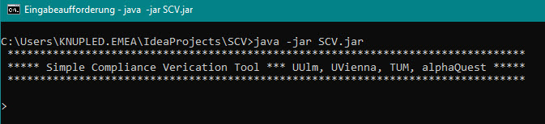

# SCV
A simple compliance verification tool written by David Knuplesch.

## Requirements:
The SCV tool requires Java. We recommend Java 11 but later and older versions up from Java 8 may work as well. 
If you do not have java installed yet, you may download a Java openJDK (e.g. from Microsoft: https://docs.microsoft.com/en-us/java/openjdk/download).

## Quick guide: 
1. Download the [SCV.jar](SCV.jar).
2. Run 'java -jar SCV.jar' from your command line
3. Now the SCV tool should open and you see its command line interface...

##First steps and useful commands

### The help function
As always the most useful command is _help_. Simply enter _help_ and a list of the most common commands is shown.

The _help_ function also provides more information about a given command. 
Use _help \<command\>_ and the given command and its syntax will be described.
For example _help createEcrg_ shows the following description of the command _createEcrg_: 

### Defining compliance rules  
The SCV tool supports defining the various kinds of compliance rules as eCRG.     
Defining an eCRG takes 4 steps: 
1. First, a new eCRG is created using command _createEcrg_.
_createEcrg_ expects three parameters: 
    * \<name\> the name of the new eCRG.
    * \<numberOfNodes\> the number of nodes of the new eCRG.
    * \<numberOfEdges\> the number of edges of the new eCRG.
   
    For example, _createEcrg newEcrg 2 1_ creates a new Ecrg with name newEcrg' having 2 nodes and one edge.

2. Next, the nodes of an eCRG need to be defined using command _defineEcrgNode_.
_defineEcrgNode_ expects four parameters: 
   * \<ecrg\> the name of the eCRG
   * \<id\> the id of the new node (starting with 0, must be lower than the number of nodes)
   * \<pattern\> := AnteOcc|AnteAbs|ConsOcc|ConsAbs the eCRG (sub-)pattern of the new node
   * \<action\> a char representing the corresponding task or message.     
   
   For example, _defineEcrgNode newEcrg 0 AnteOcc a_ defines the first node of the eCRG with name 'newEcrg' as antecedence occurrence node for action 'a'. 
'a' may be either a task or a message exchange.  

3. After all nodes of an eCRG are specified, Edges of an eCRG are defined by command _defineEcrgEdge_.
_defineEcrgEdge_ expects five parameters:
    * \<ecrg\> the name of the eCRG
    * \<id\> the id of the new edge (starting with 0, must be lower than the number of edges)
    * \<pattern\> := AnteOcc|ConsOcc the pattern of the new node
    * \<node1\> the id of the source node of the edge
    * \<node1\> the id of the target node of the edge

    For example, _defineEcrgEdge newEcrg 0 ConsOcc 0 1_ defines the first edge of the eCRG with name 'newEcrg' as consequence edge from node 0 to node 1.

4. Command _finalizeEcrg_ completes the definition of an eCRG and compiles it into an automaton. Note, that only compiled (i.e., finalized) eCRGs can be used for compliance verification.   
_finalizeEcrg_ expects a single paramter:
   * \<ecrg\> the name of the eCRG 

   For example, _finalizeEcrg newEcrg_ completes the definition of eCRG with name 'newEcrg' and compiles it into an automaton. 

The following screenshot shows the creation of a simple eCRG with one antecedence node 'a' and one consquence node 'b' as well as a consequence edge from 'a' to 'b':

### Defining process models

The SCV tool supports the definition of process models using expressions that are known from regular expressions. 
Command _createProcess_ creates a new Process model and expects two parameters:
   * \<name\> the name of the new process
   * \<process\> a description of a process 
     * using the following gateways/operators:
       * | xor
       * % parallel
       * (..) sequence
       * (..)+ loop
       * (..)* optional loop
     * for tasks use single characters from a-z and 0-9
     * for outgoing message use upper case characters from A-Z
     * for incoming message use corresponding lower case characters from a-z
   
   For example _createProcess newProcess a(b|(cd)+)ef_ creates a new process model with name 'newProcess'.
   'newProcess' starts with 'a'. Next either 'b' or 'c' and then 'd' need to happen. The sequence 'c' and then 'd' may be repeated. Then 'e' and, finally, 'f' close the process.  

### Verifying local compliance (traditional compliance checking) 

Command _verifyLocalCompliance_ checks whether a process model complies with a given (local) compliance rule. 
_verifyLocalCompliance_ expects two parameters:          
  * \<process\> the name of the process to be verified
  * \<ecrg\> the name of the compliance rule to be checked

  For example, _verifyLocalCompliance newProcess newEcrg_ verifies whether process model 'newProcess' complies with compliance rule 'newEcrg'.
  _verifyLocalCompliance_ provides a counter example, when compliance is violated.   

### Verifying eCRG decompositions 

Command _verifyEcrgDecomposition_ checks whether the decomposition of a global compliance rule into smaller compliance rules is valid.
_verifyEcrgDecomposition_ expects two parameters:
  * \<globalEcrg\> the name of the global compliance rule to be decomposed
  * \<decompositionEcrg\> the names of the compliance rules that are part of the decomposition

For example, _verifyEcrgDecomposition globalEcrg decomposedEcrg1 decomposedEcrg2_ verifies whether global compliance rule 'newProcess' complies with compliance rule 'globalEcrg' can be successfully decomposed into 'decomposedEcrg1' and 'decomposedEcrg2'.

### A textbook example 
The following Example defines three eCRGs and one process model in order to sketch the use of the commands that were introduced above:

    createEcrg globalRule 2 1
    defineEcrgNode globalRule 0 AnteOcc a
    defineEcrgNode globalRule 1 ConsOcc c
    defineEcrgEdge globalRule 0 ConsOcc 0 1
    finalizeEcrg globalRule
    
    createProcess process a(b%c)d
     
    createEcrg rule1 2 1
    defineEcrgNode rule1 0 AnteOcc a
    defineEcrgNode rule1 1 ConsOcc b
    defineEcrgEdge rule1 0 ConsOcc 0 1
    finalizeEcrg rule1

    createEcrg rule2 2 1
    defineEcrgNode rule2 0 AnteOcc b
    defineEcrgNode rule2 1 ConsOcc c
    defineEcrgEdge rule2 0 ConsOcc 0 1
    finalizeEcrg rule2

    createEcrg rule3 2 1
    defineEcrgNode rule3 0 AnteOcc c
    defineEcrgNode rule3 1 ConsOcc b
    defineEcrgEdge rule3 0 ConsOcc 0 1
    finalizeEcrg rule3

Now we can do some checks:

    verifyLocalCompliance process globalRule
   ~> true

    verifyLocalCompliance process rule1
   ~> true

    verifyLocalCompliance process rule2
   ~> false - e.g., trace 'acbd' is supported by process model 'process' but violates eCRG 'rule2'  

    verifyEcrgDecomposition globalRule rule1 rule2
   ~> true

    verifyEcrgDecomposition globalRule rule1 rule3
   ~> false - e.g., trace 'ab' is supported by 'rule1' and 'rule3', but not by 'globalRule'

    
### Saying goodbye
For some reasons, you may sometimes want to leave the SCV. Just use _exit_ and the SCV tool closes.  

### Remarks  
Please note, that this document is incomplete and the libraries of the SCV tool provides further algorithms and checks (e.g., compliability checking) and not all of them are accessible through the command line interface.       

__Finally, keep in mind: The SCV tool is a proof-of-concept prototype, please use it and its results carefully and at your own risk.__  

